#WordPress安装配置

pasta_ping

系统：Window10 64位
##安装xampp(Apache+MariaDB+PHP+Perl)
https://www.apachefriends.org/zh_cn/index.html
这个是下载exe文件安装的方式，我没试，应该一路下一步就可以直接使用了。
我用的是压缩包，解压到你自己的文件夹里，然后进行配置(要集中精神)

##配置xampp
运行xampp-control，可以看到如下的界面(忽略Ports(s)和Action的状态)

尝试点击Apache的Start按钮，一般情况下是跑不起来的。
那么从头开始配置
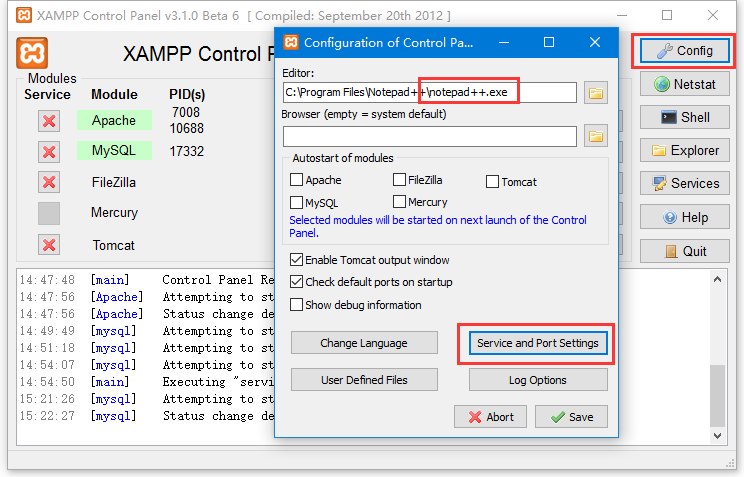

Config点开之后就是这个小界面，将原notepad换成你的文本编辑器。
点击Service and Port Settings
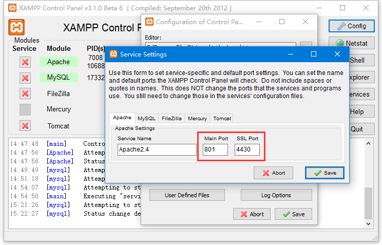

将原来的 Main Port 80 和SSL Port 443 换成不太可能重复的值。我这里是换成801和4430.
MySql的端口一般不会有冲突，保持3306。
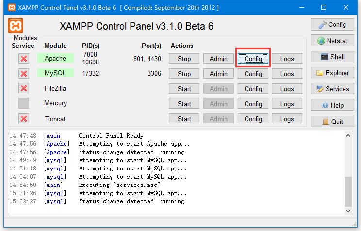

点击Apache的Config
分别配置
httpd.conf
所有包含Directory的字段改成你放置XAMPP的位置，
Listen 80 端口号改为你修改的，我的是801，
记住DocumentRoot字段，后面还要配置它
httpd-ssl.conf
将443端口改为你修改的，我的是4430
DocumentRoot后面也要改。

my.ini
同理，修改mysql的配置文件my.ini
将当中的目录换成你自己的。

使用管理员模式启动cmd，进入mysql\bin目录。
运行命令 
mysqld --install

至此，配置结束，可以点击start按钮运行起来了。

##配置wordpress
官网下载
https://cn.wordpress.org/
解压缩并放至你选择的目录下。
将apache两个配置文件的DocumentRoot目录指向这个文件夹。
(也可以直接放到XAMMP的DoucumentRoot下)

浏览器输入本机ip:端口号，看到的应该是这个
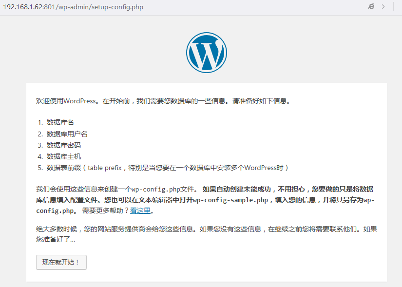
页面会引导完成数据库的创建。

这个数据库是要去手动建立的，根据实际名字通过命令行或者navicat建立该数据库
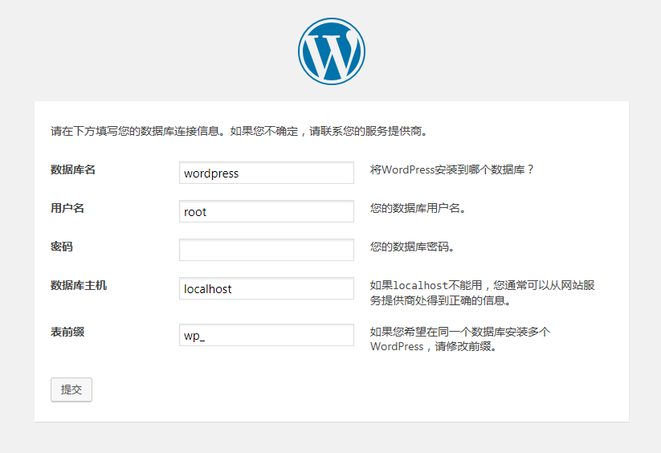
有的网上攻略说不允许空密码，那可能是以前的版本了，现在可以为空。
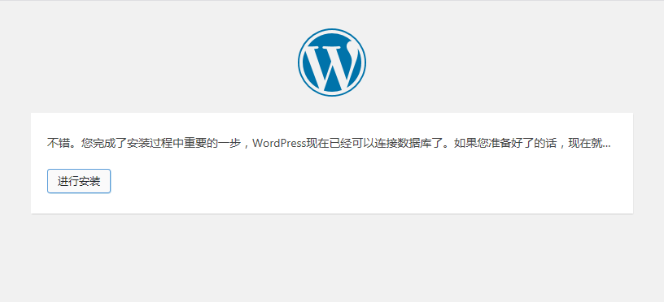
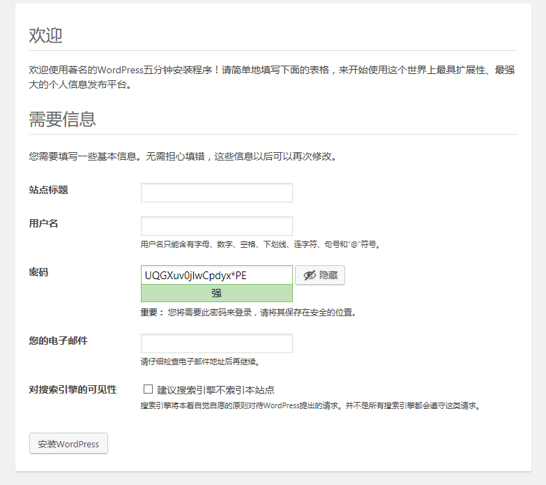

密码还是改了吧，要记牢，不过忘记了也有办法。
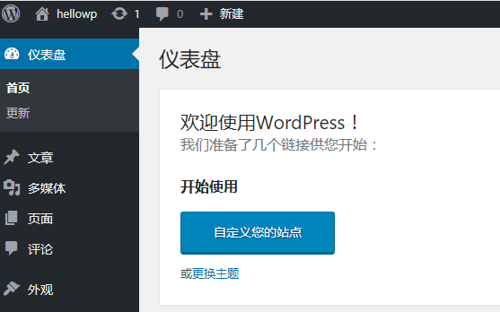
成功！

##安装tthl主题
将
```...\hlingwww\wp\wp-content\themes```
文件夹下的tthl目录copy至
```...\wordpress\wp-content\themes目录```
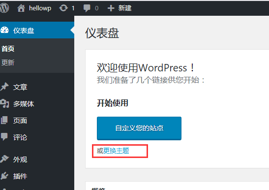
点击更换主题
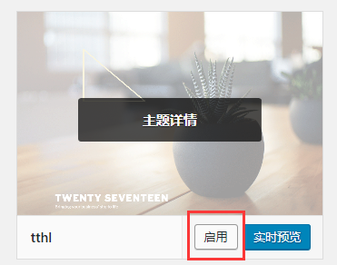
这时可以看到tthl的主题了，点击启用
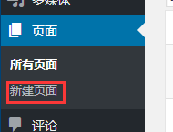
开始新建页面
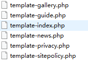
带template开头的php文件为我们的网站页面，需要添加至站点。
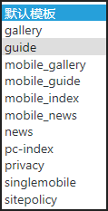

选择模版的位置，可以看到这些东西，它们与下图的文件头注释是相呼应的。
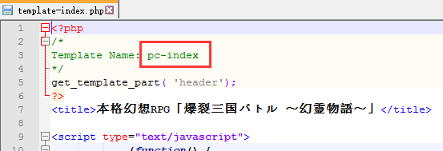
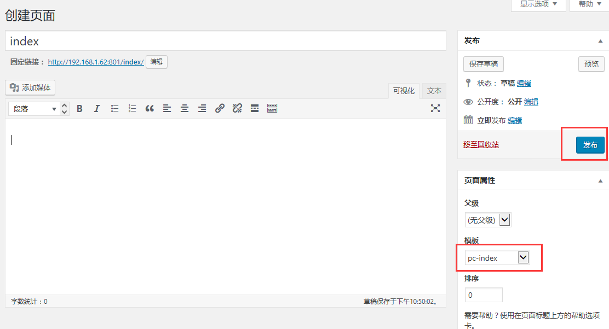

创建页面仅需要输入标题(没有严格要求)和模版，即可发布


设置主页

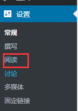
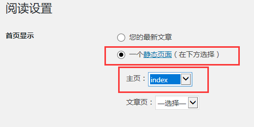

至此，刷新访问已经可以看到帅气的原画了。


